# LeetCode Solutions

Accepted [LeetCode](https://leetcode.com) solutions, each written up step by step: the idea that cracks the problem, the code, the complexity, and the runtime it clocked. Start with a language folder under Progress, or open the full problem index below.

## Progress

<!-- LEETCODE_SYNC_STATS_START -->




### By language

| Folder | Problems | Easy | Medium | Hard | Last updated |
|:---:|:---:|:---:|:---:|:---:|:---:|
| [Python](Python/README.md) | 1 | 1 | 0 | 0 | Jul&nbsp;10,&nbsp;2026 |
| [SQL](SQL/README.md) | 36 | 30 | 6 | 0 | Jul&nbsp;18,&nbsp;2026 |

<details>
<summary><b>By topic</b> · 1 topic</summary>

| Topic | Solved | Easy | Medium | Hard | Problems |
|:--|:--:|:--:|:--:|:--:|:--|
| **Database** | 37 | 31 | 6 | 0 | [175. Combine Two Tables](SQL/0175-combine-two-tables/README.md), [176. Second Highest Salary](SQL/0176-second-highest-salary/README.md), [177. Nth Highest Salary](SQL/0177-nth-highest-salary/README.md), [181. Employees Earning More Than Their Managers](SQL/0181-employees-earning-more-than-their-managers/README.md), [182. Duplicate Emails](SQL/0182-duplicate-emails/README.md), [183. Customers Who Never Order](SQL/0183-customers-who-never-order/README.md), [196. Delete Duplicate Emails](SQL/0196-delete-duplicate-emails/README.md), [197. Rising Temperature](SQL/0197-rising-temperature/README.md), [511. Game Play Analysis I](SQL/0511-game-play-analysis-i/README.md), [577. Employee Bonus](SQL/0577-employee-bonus/README.md), [584. Find Customer Referee](SQL/0584-find-customer-referee/README.md), [586. Customer Placing the Largest Number of Orders](SQL/0586-customer-placing-the-largest-number-of-orders/README.md), [595. Big Countries](Python/Pandas/0595-big-countries/README.md), [595. Big Countries](SQL/0595-big-countries/README.md), [596. Classes With at Least 5 Students](SQL/0596-classes-with-at-least-5-students/README.md), [607. Sales Person](SQL/0607-sales-person/README.md), [610. Triangle Judgement](SQL/0610-triangle-judgement/README.md), [619. Biggest Single Number](SQL/0619-biggest-single-number/README.md), [620. Not Boring Movies](SQL/0620-not-boring-movies/README.md), [627. Swap Sex of Employees](SQL/0627-swap-sex-of-employees/README.md), [1045. Customers Who Bought All Products](SQL/1045-customers-who-bought-all-products/README.md), [1050. Actors and Directors Who Cooperated At Least Three Times](SQL/1050-actors-and-directors-who-cooperated-at-least-three-times/README.md), [1075. Project Employees I](SQL/1075-project-employees-i/README.md), [1084. Sales Analysis III](SQL/1084-sales-analysis-iii/README.md), [1141. User Activity for the Past 30 Days I](SQL/1141-user-activity-for-the-past-30-days-i/README.md), [1174. Immediate Food Delivery II](SQL/1174-immediate-food-delivery-ii/README.md), [1179. Reformat Department Table](SQL/1179-reformat-department-table/README.md), [1193. Monthly Transactions I](SQL/1193-monthly-transactions-i/README.md), [1211. Queries Quality and Percentage](SQL/1211-queries-quality-and-percentage/README.md), [1251. Average Selling Price](SQL/1251-average-selling-price/README.md), [1393. Capital Gain/Loss](SQL/1393-capital-gainloss/README.md), [1517. Find Users With Valid E-Mails](SQL/1517-find-users-with-valid-e-mails/README.md), [1527. Patients With a Condition](SQL/1527-patients-with-a-condition/README.md), [1587. Bank Account Summary II](SQL/1587-bank-account-summary-ii/README.md), [1633. Percentage of Users Attended a Contest](SQL/1633-percentage-of-users-attended-a-contest/README.md), [1693. Daily Leads and Partners](SQL/1693-daily-leads-and-partners/README.md), [1873. Calculate Special Bonus](SQL/1873-calculate-special-bonus/README.md) |

</details>
<!-- LEETCODE_SYNC_STATS_END -->

## Problems

<!-- LEETCODE_SYNC_TABLE_START -->
<details>
<summary><b>All 37 problems</b></summary>

| # | Problem | Difficulty | Topics | Language | Solution | Syncs | Updated |
|:---:|:---:|:---:|:---:|:---:|:---:|:---:|:---:|
| 175 | [Combine Two Tables](https://leetcode.com/problems/combine-two-tables/) | Easy | Database | SQL | [approach](SQL/0175-combine-two-tables/README.md)&nbsp;·&nbsp;[code](SQL/0175-combine-two-tables/0175-combine-two-tables.sql) | 2 | Jul&nbsp;10,&nbsp;2026 |
| 176 | [Second Highest Salary](https://leetcode.com/problems/second-highest-salary/) | Medium | Database | SQL | [approach](SQL/0176-second-highest-salary/README.md)&nbsp;·&nbsp;[code](SQL/0176-second-highest-salary/0176-second-highest-salary.sql) | 2 | Jul&nbsp;11,&nbsp;2026 |
| 177 | [Nth Highest Salary](https://leetcode.com/problems/nth-highest-salary/) | Medium | Database | SQL | [approach](SQL/0177-nth-highest-salary/README.md)&nbsp;·&nbsp;[code](SQL/0177-nth-highest-salary/0177-nth-highest-salary.sql) | 3 | Jul&nbsp;11,&nbsp;2026 |
| 181 | [Employees Earning More Than Their Managers](https://leetcode.com/problems/employees-earning-more-than-their-managers/) | Easy | Database | SQL | [approach](SQL/0181-employees-earning-more-than-their-managers/README.md)&nbsp;·&nbsp;[code](SQL/0181-employees-earning-more-than-their-managers/0181-employees-earning-more-than-their-managers.sql) | 2 | Jul&nbsp;12,&nbsp;2026 |
| 182 | [Duplicate Emails](https://leetcode.com/problems/duplicate-emails/) | Easy | Database | SQL | [approach](SQL/0182-duplicate-emails/README.md)&nbsp;·&nbsp;[code](SQL/0182-duplicate-emails/0182-duplicate-emails.sql) | 1 | Jul&nbsp;11,&nbsp;2026 |
| 183 | [Customers Who Never Order](https://leetcode.com/problems/customers-who-never-order/) | Easy | Database | SQL | [approach](SQL/0183-customers-who-never-order/README.md)&nbsp;·&nbsp;[code](SQL/0183-customers-who-never-order/0183-customers-who-never-order.sql) | 2 | Jul&nbsp;10,&nbsp;2026 |
| 196 | [Delete Duplicate Emails](https://leetcode.com/problems/delete-duplicate-emails/) | Easy | Database | SQL | [approach](SQL/0196-delete-duplicate-emails/README.md)&nbsp;·&nbsp;[code](SQL/0196-delete-duplicate-emails/0196-delete-duplicate-emails.sql) | 1 | Jul&nbsp;11,&nbsp;2026 |
| 197 | [Rising Temperature](https://leetcode.com/problems/rising-temperature/) | Easy | Database | SQL | [approach](SQL/0197-rising-temperature/README.md)&nbsp;·&nbsp;[code](SQL/0197-rising-temperature/0197-rising-temperature.sql) | 1 | Jul&nbsp;11,&nbsp;2026 |
| 511 | [Game Play Analysis I](https://leetcode.com/problems/game-play-analysis-i/) | Easy | Database | SQL | [approach](SQL/0511-game-play-analysis-i/README.md)&nbsp;·&nbsp;[code](SQL/0511-game-play-analysis-i/0511-game-play-analysis-i.sql) | 1 | Jul&nbsp;15,&nbsp;2026 |
| 577 | [Employee Bonus](https://leetcode.com/problems/employee-bonus/) | Easy | Database | SQL | [approach](SQL/0577-employee-bonus/README.md)&nbsp;·&nbsp;[code](SQL/0577-employee-bonus/0577-employee-bonus.sql) | 1 | Jul&nbsp;12,&nbsp;2026 |
| 584 | [Find Customer Referee](https://leetcode.com/problems/find-customer-referee/) | Easy | Database | SQL | [approach](SQL/0584-find-customer-referee/README.md)&nbsp;·&nbsp;[code](SQL/0584-find-customer-referee/0584-find-customer-referee.sql) | 1 | Jul&nbsp;15,&nbsp;2026 |
| 586 | [Customer Placing the Largest Number of Orders](https://leetcode.com/problems/customer-placing-the-largest-number-of-orders/) | Easy | Database | SQL | [approach](SQL/0586-customer-placing-the-largest-number-of-orders/README.md)&nbsp;·&nbsp;[code](SQL/0586-customer-placing-the-largest-number-of-orders/0586-customer-placing-the-largest-number-of-orders.sql) | 3 | Jul&nbsp;15,&nbsp;2026 |
| 595 | [Big Countries](https://leetcode.com/problems/big-countries/) | Easy | Database | Python · Pandas | [approach](Python/Pandas/0595-big-countries/README.md)&nbsp;·&nbsp;[code](Python/Pandas/0595-big-countries/0595-big-countries.py) | 1 | Jul&nbsp;10,&nbsp;2026 |
| 595 | [Big Countries](https://leetcode.com/problems/big-countries/) | Easy | Database | SQL | [approach](SQL/0595-big-countries/README.md)&nbsp;·&nbsp;[code](SQL/0595-big-countries/0595-big-countries.sql) | 1 | Jul&nbsp;11,&nbsp;2026 |
| 596 | [Classes With at Least 5 Students](https://leetcode.com/problems/classes-with-at-least-5-students/) | Easy | Database | SQL | [approach](SQL/0596-classes-with-at-least-5-students/README.md)&nbsp;·&nbsp;[code](SQL/0596-classes-with-at-least-5-students/0596-classes-with-at-least-5-students.sql) | 1 | Jul&nbsp;15,&nbsp;2026 |
| 607 | [Sales Person](https://leetcode.com/problems/sales-person/) | Easy | Database | SQL | [approach](SQL/0607-sales-person/README.md)&nbsp;·&nbsp;[code](SQL/0607-sales-person/0607-sales-person.sql) | 2 | Jul&nbsp;17,&nbsp;2026 |
| 610 | [Triangle Judgement](https://leetcode.com/problems/triangle-judgement/) | Easy | Database | SQL | [approach](SQL/0610-triangle-judgement/README.md)&nbsp;·&nbsp;[code](SQL/0610-triangle-judgement/0610-triangle-judgement.sql) | 2 | Jul&nbsp;17,&nbsp;2026 |
| 619 | [Biggest Single Number](https://leetcode.com/problems/biggest-single-number/) | Easy | Database | SQL | [approach](SQL/0619-biggest-single-number/README.md)&nbsp;·&nbsp;[code](SQL/0619-biggest-single-number/0619-biggest-single-number.sql) | 1 | Jul&nbsp;15,&nbsp;2026 |
| 620 | [Not Boring Movies](https://leetcode.com/problems/not-boring-movies/) | Easy | Database | SQL | [approach](SQL/0620-not-boring-movies/README.md)&nbsp;·&nbsp;[code](SQL/0620-not-boring-movies/0620-not-boring-movies.sql) | 1 | Jul&nbsp;12,&nbsp;2026 |
| 627 | [Swap Sex of Employees](https://leetcode.com/problems/swap-sex-of-employees/) | Easy | Database | SQL | [approach](SQL/0627-swap-sex-of-employees/README.md)&nbsp;·&nbsp;[code](SQL/0627-swap-sex-of-employees/0627-swap-sex-of-employees.sql) | 1 | Jul&nbsp;17,&nbsp;2026 |
| 1045 | [Customers Who Bought All Products](https://leetcode.com/problems/customers-who-bought-all-products/) | Medium | Database | SQL | [approach](SQL/1045-customers-who-bought-all-products/README.md)&nbsp;·&nbsp;[code](SQL/1045-customers-who-bought-all-products/1045-customers-who-bought-all-products.sql) | 1 | Jul&nbsp;12,&nbsp;2026 |
| 1050 | [Actors and Directors Who Cooperated At Least Three Times](https://leetcode.com/problems/actors-and-directors-who-cooperated-at-least-three-times/) | Easy | Database | SQL | [approach](SQL/1050-actors-and-directors-who-cooperated-at-least-three-times/README.md)&nbsp;·&nbsp;[code](SQL/1050-actors-and-directors-who-cooperated-at-least-three-times/1050-actors-and-directors-who-cooperated-at-least-three-times.sql) | 1 | Jul&nbsp;15,&nbsp;2026 |
| 1075 | [Project Employees I](https://leetcode.com/problems/project-employees-i/) | Easy | Database | SQL | [approach](SQL/1075-project-employees-i/README.md)&nbsp;·&nbsp;[code](SQL/1075-project-employees-i/1075-project-employees-i.sql) | 1 | Jul&nbsp;15,&nbsp;2026 |
| 1084 | [Sales Analysis III](https://leetcode.com/problems/sales-analysis-iii/) | Easy | Database | SQL | [approach](SQL/1084-sales-analysis-iii/README.md)&nbsp;·&nbsp;[code](SQL/1084-sales-analysis-iii/1084-sales-analysis-iii.sql) | 1 | Jul&nbsp;17,&nbsp;2026 |
| 1141 | [User Activity for the Past 30 Days I](https://leetcode.com/problems/user-activity-for-the-past-30-days-i/) | Easy | Database | SQL | [approach](SQL/1141-user-activity-for-the-past-30-days-i/README.md)&nbsp;·&nbsp;[code](SQL/1141-user-activity-for-the-past-30-days-i/1141-user-activity-for-the-past-30-days-i.sql) | 1 | Jul&nbsp;17,&nbsp;2026 |
| 1174 | [Immediate Food Delivery II](https://leetcode.com/problems/immediate-food-delivery-ii/) | Medium | Database | SQL | [approach](SQL/1174-immediate-food-delivery-ii/README.md)&nbsp;·&nbsp;[code](SQL/1174-immediate-food-delivery-ii/1174-immediate-food-delivery-ii.sql) | 1 | Jul&nbsp;17,&nbsp;2026 |
| 1179 | [Reformat Department Table](https://leetcode.com/problems/reformat-department-table/) | Easy | Database | SQL | [approach](SQL/1179-reformat-department-table/README.md)&nbsp;·&nbsp;[code](SQL/1179-reformat-department-table/1179-reformat-department-table.sql) | 1 | Jul&nbsp;17,&nbsp;2026 |
| 1193 | [Monthly Transactions I](https://leetcode.com/problems/monthly-transactions-i/) | Medium | Database | SQL | [approach](SQL/1193-monthly-transactions-i/README.md)&nbsp;·&nbsp;[code](SQL/1193-monthly-transactions-i/1193-monthly-transactions-i.sql) | 2 | Jul&nbsp;15,&nbsp;2026 |
| 1211 | [Queries Quality and Percentage](https://leetcode.com/problems/queries-quality-and-percentage/) | Easy | Database | SQL | [approach](SQL/1211-queries-quality-and-percentage/README.md)&nbsp;·&nbsp;[code](SQL/1211-queries-quality-and-percentage/1211-queries-quality-and-percentage.sql) | 1 | Jul&nbsp;15,&nbsp;2026 |
| 1251 | [Average Selling Price](https://leetcode.com/problems/average-selling-price/) | Easy | Database | SQL | [approach](SQL/1251-average-selling-price/README.md)&nbsp;·&nbsp;[code](SQL/1251-average-selling-price/1251-average-selling-price.sql) | 4 | Jul&nbsp;16,&nbsp;2026 |
| 1393 | [Capital Gain/Loss](https://leetcode.com/problems/capital-gainloss/) | Medium | Database | SQL | [approach](SQL/1393-capital-gainloss/README.md)&nbsp;·&nbsp;[code](SQL/1393-capital-gainloss/1393-capital-gainloss.sql) | 1 | Jul&nbsp;18,&nbsp;2026 |
| 1517 | [Find Users With Valid E-Mails](https://leetcode.com/problems/find-users-with-valid-e-mails/) | Easy | Database | SQL | [approach](SQL/1517-find-users-with-valid-e-mails/README.md)&nbsp;·&nbsp;[code](SQL/1517-find-users-with-valid-e-mails/1517-find-users-with-valid-e-mails.sql) | 8 | Jul&nbsp;11,&nbsp;2026 |
| 1527 | [Patients With a Condition](https://leetcode.com/problems/patients-with-a-condition/) | Easy | Database | SQL | [approach](SQL/1527-patients-with-a-condition/README.md)&nbsp;·&nbsp;[code](SQL/1527-patients-with-a-condition/1527-patients-with-a-condition.sql) | 2 | Jul&nbsp;12,&nbsp;2026 |
| 1587 | [Bank Account Summary II](https://leetcode.com/problems/bank-account-summary-ii/) | Easy | Database | SQL | [approach](SQL/1587-bank-account-summary-ii/README.md)&nbsp;·&nbsp;[code](SQL/1587-bank-account-summary-ii/1587-bank-account-summary-ii.sql) | 1 | Jul&nbsp;16,&nbsp;2026 |
| 1633 | [Percentage of Users Attended a Contest](https://leetcode.com/problems/percentage-of-users-attended-a-contest/) | Easy | Database | SQL | [approach](SQL/1633-percentage-of-users-attended-a-contest/README.md)&nbsp;·&nbsp;[code](SQL/1633-percentage-of-users-attended-a-contest/1633-percentage-of-users-attended-a-contest.sql) | 2 | Jul&nbsp;17,&nbsp;2026 |
| 1693 | [Daily Leads and Partners](https://leetcode.com/problems/daily-leads-and-partners/) | Easy | Database | SQL | [approach](SQL/1693-daily-leads-and-partners/README.md)&nbsp;·&nbsp;[code](SQL/1693-daily-leads-and-partners/1693-daily-leads-and-partners.sql) | 1 | Jul&nbsp;17,&nbsp;2026 |
| 1873 | [Calculate Special Bonus](https://leetcode.com/problems/calculate-special-bonus/) | Easy | Database | SQL | [approach](SQL/1873-calculate-special-bonus/README.md)&nbsp;·&nbsp;[code](SQL/1873-calculate-special-bonus/1873-calculate-special-bonus.sql) | 1 | Jul&nbsp;12,&nbsp;2026 |

<sub><b>Syncs</b> = accepted pushes for that problem, so a re-solve bumps it.</sub>

</details>
<!-- LEETCODE_SYNC_TABLE_END -->

## Inside a problem folder

Every problem follows the same shape:

```text
SQL/0176-second-highest-salary/
├── README.md                         the approach: idea, steps, complexity, runtime
└── 0176-second-highest-salary.sql    the exact code LeetCode accepted
```

Each approach opens with the idea that cracks the problem, walks through the code in numbered steps, and records the complexity and measured runtime, with the full statement collapsed at the end.

## How to use this repo

- **Revisiting a topic** — scan the Topics column in the problem index; each approach leads with the one idea worth remembering, so a skim rebuilds intuition fast.
- **Before an interview** — reread the approach notes instead of code. If the summary alone brings it back, move on; if not, that problem is due for a re-solve.
- **Spotting weak areas** — the Syncs column shows which problems took several attempts, and the per-language cards make lopsided difficulty splits obvious at a glance.
- **Tracking momentum** — the progress card, badges, and folder table refresh with every accepted submission, in the same commit as the code they describe.

---

<sub>Maintained automatically: each accepted submission lands as one commit containing the code, its approach, and every index shown above.</sub>
