[← All problems](../README.md)

# SQL Solutions

The database track, solved in SQL: shaping queries with joins, grouping and aggregation, filtering on grouped results, and window functions when a problem calls for them. Every entry pairs the accepted code with a short approach: the idea first, then the steps, the complexity, and the measured runtime.

## Progress

<!-- LEETCODE_SYNC_STATS_START -->

### Topics covered

<!-- LEETCODE_SYNC_STATS_END -->

## Problems

<!-- LEETCODE_SYNC_TABLE_START -->

| # | Problem | Difficulty | Topics | Solution | Syncs | Updated |
|:---:|:---:|:---:|:---:|:---:|:---:|:---:|
| 175 | [Combine Two Tables](https://leetcode.com/problems/combine-two-tables/) | Easy | Database | [approach](0175-combine-two-tables/README.md)&nbsp;·&nbsp;[code](0175-combine-two-tables/0175-combine-two-tables.sql) | 2 | Jul&nbsp;10,&nbsp;2026 |
| 176 | [Second Highest Salary](https://leetcode.com/problems/second-highest-salary/) | Medium | Database | [approach](0176-second-highest-salary/README.md)&nbsp;·&nbsp;[code](0176-second-highest-salary/0176-second-highest-salary.sql) | 1 | Jul&nbsp;10,&nbsp;2026 |
| 183 | [Customers Who Never Order](https://leetcode.com/problems/customers-who-never-order/) | Easy | Database | [approach](0183-customers-who-never-order/README.md)&nbsp;·&nbsp;[code](0183-customers-who-never-order/0183-customers-who-never-order.sql) | 2 | Jul&nbsp;10,&nbsp;2026 |

<b>Syncs</b> = accepted pushes for that problem, so a re-solve bumps it.

<!-- LEETCODE_SYNC_TABLE_END -->

Every row is an accepted submission. Open the approach for the reasoning, not just the code — future you will thank present you.
