[← All problems](../README.md)

# SQL Solutions

The database track, solved in SQL: shaping queries with joins, grouping and aggregation, filtering on grouped results, and window functions when a problem calls for them. Every entry pairs the accepted code with a short approach: the idea first, then the steps, the complexity, and the measured runtime.

## Progress

<!-- LEETCODE_SYNC_STATS_START -->

### Topics covered

<!-- LEETCODE_SYNC_STATS_END -->

## Problems

<!-- LEETCODE_SYNC_TABLE_START -->

| # | Problem | Difficulty | Topics | Solution | Syncs | Updated |
|:---:|:---:|:---:|:---:|:---:|:---:|:---:|
| 175 | [Combine Two Tables](https://leetcode.com/problems/combine-two-tables/) | Easy | Database | [approach](0175-combine-two-tables/README.md)&nbsp;·&nbsp;[code](0175-combine-two-tables/0175-combine-two-tables.sql) | 2 | Jul&nbsp;10,&nbsp;2026 |
| 176 | [Second Highest Salary](https://leetcode.com/problems/second-highest-salary/) | Medium | Database | [approach](0176-second-highest-salary/README.md)&nbsp;·&nbsp;[code](0176-second-highest-salary/0176-second-highest-salary.sql) | 2 | Jul&nbsp;11,&nbsp;2026 |
| 177 | [Nth Highest Salary](https://leetcode.com/problems/nth-highest-salary/) | Medium | Database | [approach](0177-nth-highest-salary/README.md)&nbsp;·&nbsp;[code](0177-nth-highest-salary/0177-nth-highest-salary.sql) | 3 | Jul&nbsp;11,&nbsp;2026 |
| 181 | [Employees Earning More Than Their Managers](https://leetcode.com/problems/employees-earning-more-than-their-managers/) | Easy | Database | [approach](0181-employees-earning-more-than-their-managers/README.md)&nbsp;·&nbsp;[code](0181-employees-earning-more-than-their-managers/0181-employees-earning-more-than-their-managers.sql) | 2 | Jul&nbsp;12,&nbsp;2026 |
| 182 | [Duplicate Emails](https://leetcode.com/problems/duplicate-emails/) | Easy | Database | [approach](0182-duplicate-emails/README.md)&nbsp;·&nbsp;[code](0182-duplicate-emails/0182-duplicate-emails.sql) | 1 | Jul&nbsp;11,&nbsp;2026 |
| 183 | [Customers Who Never Order](https://leetcode.com/problems/customers-who-never-order/) | Easy | Database | [approach](0183-customers-who-never-order/README.md)&nbsp;·&nbsp;[code](0183-customers-who-never-order/0183-customers-who-never-order.sql) | 2 | Jul&nbsp;10,&nbsp;2026 |
| 196 | [Delete Duplicate Emails](https://leetcode.com/problems/delete-duplicate-emails/) | Easy | Database | [approach](0196-delete-duplicate-emails/README.md)&nbsp;·&nbsp;[code](0196-delete-duplicate-emails/0196-delete-duplicate-emails.sql) | 1 | Jul&nbsp;11,&nbsp;2026 |
| 197 | [Rising Temperature](https://leetcode.com/problems/rising-temperature/) | Easy | Database | [approach](0197-rising-temperature/README.md)&nbsp;·&nbsp;[code](0197-rising-temperature/0197-rising-temperature.sql) | 1 | Jul&nbsp;11,&nbsp;2026 |
| 511 | [Game Play Analysis I](https://leetcode.com/problems/game-play-analysis-i/) | Easy | Database | [approach](0511-game-play-analysis-i/README.md)&nbsp;·&nbsp;[code](0511-game-play-analysis-i/0511-game-play-analysis-i.sql) | 1 | Jul&nbsp;15,&nbsp;2026 |
| 577 | [Employee Bonus](https://leetcode.com/problems/employee-bonus/) | Easy | Database | [approach](0577-employee-bonus/README.md)&nbsp;·&nbsp;[code](0577-employee-bonus/0577-employee-bonus.sql) | 1 | Jul&nbsp;12,&nbsp;2026 |
| 584 | [Find Customer Referee](https://leetcode.com/problems/find-customer-referee/) | Easy | Database | [approach](0584-find-customer-referee/README.md)&nbsp;·&nbsp;[code](0584-find-customer-referee/0584-find-customer-referee.sql) | 1 | Jul&nbsp;15,&nbsp;2026 |
| 586 | [Customer Placing the Largest Number of Orders](https://leetcode.com/problems/customer-placing-the-largest-number-of-orders/) | Easy | Database | [approach](0586-customer-placing-the-largest-number-of-orders/README.md)&nbsp;·&nbsp;[code](0586-customer-placing-the-largest-number-of-orders/0586-customer-placing-the-largest-number-of-orders.sql) | 3 | Jul&nbsp;15,&nbsp;2026 |
| 595 | [Big Countries](https://leetcode.com/problems/big-countries/) | Easy | Database | [approach](0595-big-countries/README.md)&nbsp;·&nbsp;[code](0595-big-countries/0595-big-countries.sql) | 1 | Jul&nbsp;11,&nbsp;2026 |
| 596 | [Classes With at Least 5 Students](https://leetcode.com/problems/classes-with-at-least-5-students/) | Easy | Database | [approach](0596-classes-with-at-least-5-students/README.md)&nbsp;·&nbsp;[code](0596-classes-with-at-least-5-students/0596-classes-with-at-least-5-students.sql) | 1 | Jul&nbsp;15,&nbsp;2026 |
| 607 | [Sales Person](https://leetcode.com/problems/sales-person/) | Easy | Database | [approach](0607-sales-person/README.md)&nbsp;·&nbsp;[code](0607-sales-person/0607-sales-person.sql) | 2 | Jul&nbsp;17,&nbsp;2026 |
| 610 | [Triangle Judgement](https://leetcode.com/problems/triangle-judgement/) | Easy | Database | [approach](0610-triangle-judgement/README.md)&nbsp;·&nbsp;[code](0610-triangle-judgement/0610-triangle-judgement.sql) | 2 | Jul&nbsp;17,&nbsp;2026 |
| 619 | [Biggest Single Number](https://leetcode.com/problems/biggest-single-number/) | Easy | Database | [approach](0619-biggest-single-number/README.md)&nbsp;·&nbsp;[code](0619-biggest-single-number/0619-biggest-single-number.sql) | 1 | Jul&nbsp;15,&nbsp;2026 |
| 620 | [Not Boring Movies](https://leetcode.com/problems/not-boring-movies/) | Easy | Database | [approach](0620-not-boring-movies/README.md)&nbsp;·&nbsp;[code](0620-not-boring-movies/0620-not-boring-movies.sql) | 1 | Jul&nbsp;12,&nbsp;2026 |
| 627 | [Swap Sex of Employees](https://leetcode.com/problems/swap-sex-of-employees/) | Easy | Database | [approach](0627-swap-sex-of-employees/README.md)&nbsp;·&nbsp;[code](0627-swap-sex-of-employees/0627-swap-sex-of-employees.sql) | 1 | Jul&nbsp;17,&nbsp;2026 |
| 1045 | [Customers Who Bought All Products](https://leetcode.com/problems/customers-who-bought-all-products/) | Medium | Database | [approach](1045-customers-who-bought-all-products/README.md)&nbsp;·&nbsp;[code](1045-customers-who-bought-all-products/1045-customers-who-bought-all-products.sql) | 1 | Jul&nbsp;12,&nbsp;2026 |
| 1050 | [Actors and Directors Who Cooperated At Least Three Times](https://leetcode.com/problems/actors-and-directors-who-cooperated-at-least-three-times/) | Easy | Database | [approach](1050-actors-and-directors-who-cooperated-at-least-three-times/README.md)&nbsp;·&nbsp;[code](1050-actors-and-directors-who-cooperated-at-least-three-times/1050-actors-and-directors-who-cooperated-at-least-three-times.sql) | 1 | Jul&nbsp;15,&nbsp;2026 |
| 1075 | [Project Employees I](https://leetcode.com/problems/project-employees-i/) | Easy | Database | [approach](1075-project-employees-i/README.md)&nbsp;·&nbsp;[code](1075-project-employees-i/1075-project-employees-i.sql) | 1 | Jul&nbsp;15,&nbsp;2026 |
| 1084 | [Sales Analysis III](https://leetcode.com/problems/sales-analysis-iii/) | Easy | Database | [approach](1084-sales-analysis-iii/README.md)&nbsp;·&nbsp;[code](1084-sales-analysis-iii/1084-sales-analysis-iii.sql) | 1 | Jul&nbsp;17,&nbsp;2026 |
| 1141 | [User Activity for the Past 30 Days I](https://leetcode.com/problems/user-activity-for-the-past-30-days-i/) | Easy | Database | [approach](1141-user-activity-for-the-past-30-days-i/README.md)&nbsp;·&nbsp;[code](1141-user-activity-for-the-past-30-days-i/1141-user-activity-for-the-past-30-days-i.sql) | 1 | Jul&nbsp;17,&nbsp;2026 |
| 1174 | [Immediate Food Delivery II](https://leetcode.com/problems/immediate-food-delivery-ii/) | Medium | Database | [approach](1174-immediate-food-delivery-ii/README.md)&nbsp;·&nbsp;[code](1174-immediate-food-delivery-ii/1174-immediate-food-delivery-ii.sql) | 1 | Jul&nbsp;17,&nbsp;2026 |
| 1179 | [Reformat Department Table](https://leetcode.com/problems/reformat-department-table/) | Easy | Database | [approach](1179-reformat-department-table/README.md)&nbsp;·&nbsp;[code](1179-reformat-department-table/1179-reformat-department-table.sql) | 1 | Jul&nbsp;17,&nbsp;2026 |
| 1193 | [Monthly Transactions I](https://leetcode.com/problems/monthly-transactions-i/) | Medium | Database | [approach](1193-monthly-transactions-i/README.md)&nbsp;·&nbsp;[code](1193-monthly-transactions-i/1193-monthly-transactions-i.sql) | 2 | Jul&nbsp;15,&nbsp;2026 |
| 1211 | [Queries Quality and Percentage](https://leetcode.com/problems/queries-quality-and-percentage/) | Easy | Database | [approach](1211-queries-quality-and-percentage/README.md)&nbsp;·&nbsp;[code](1211-queries-quality-and-percentage/1211-queries-quality-and-percentage.sql) | 1 | Jul&nbsp;15,&nbsp;2026 |
| 1251 | [Average Selling Price](https://leetcode.com/problems/average-selling-price/) | Easy | Database | [approach](1251-average-selling-price/README.md)&nbsp;·&nbsp;[code](1251-average-selling-price/1251-average-selling-price.sql) | 4 | Jul&nbsp;16,&nbsp;2026 |
| 1393 | [Capital Gain/Loss](https://leetcode.com/problems/capital-gainloss/) | Medium | Database | [approach](1393-capital-gainloss/README.md)&nbsp;·&nbsp;[code](1393-capital-gainloss/1393-capital-gainloss.sql) | 2 | Jul&nbsp;18,&nbsp;2026 |
| 1517 | [Find Users With Valid E-Mails](https://leetcode.com/problems/find-users-with-valid-e-mails/) | Easy | Database | [approach](1517-find-users-with-valid-e-mails/README.md)&nbsp;·&nbsp;[code](1517-find-users-with-valid-e-mails/1517-find-users-with-valid-e-mails.sql) | 8 | Jul&nbsp;11,&nbsp;2026 |
| 1527 | [Patients With a Condition](https://leetcode.com/problems/patients-with-a-condition/) | Easy | Database | [approach](1527-patients-with-a-condition/README.md)&nbsp;·&nbsp;[code](1527-patients-with-a-condition/1527-patients-with-a-condition.sql) | 2 | Jul&nbsp;12,&nbsp;2026 |
| 1587 | [Bank Account Summary II](https://leetcode.com/problems/bank-account-summary-ii/) | Easy | Database | [approach](1587-bank-account-summary-ii/README.md)&nbsp;·&nbsp;[code](1587-bank-account-summary-ii/1587-bank-account-summary-ii.sql) | 1 | Jul&nbsp;16,&nbsp;2026 |
| 1633 | [Percentage of Users Attended a Contest](https://leetcode.com/problems/percentage-of-users-attended-a-contest/) | Easy | Database | [approach](1633-percentage-of-users-attended-a-contest/README.md)&nbsp;·&nbsp;[code](1633-percentage-of-users-attended-a-contest/1633-percentage-of-users-attended-a-contest.sql) | 2 | Jul&nbsp;17,&nbsp;2026 |
| 1661 | [Average Time of Process per Machine](https://leetcode.com/problems/average-time-of-process-per-machine/) | Easy | Database | [approach](1661-average-time-of-process-per-machine/README.md)&nbsp;·&nbsp;[code](1661-average-time-of-process-per-machine/1661-average-time-of-process-per-machine.sql) | 1 | Jul&nbsp;18,&nbsp;2026 |
| 1693 | [Daily Leads and Partners](https://leetcode.com/problems/daily-leads-and-partners/) | Easy | Database | [approach](1693-daily-leads-and-partners/README.md)&nbsp;·&nbsp;[code](1693-daily-leads-and-partners/1693-daily-leads-and-partners.sql) | 1 | Jul&nbsp;17,&nbsp;2026 |
| 1789 | [Primary Department for Each Employee](https://leetcode.com/problems/primary-department-for-each-employee/) | Easy | Database | [approach](1789-primary-department-for-each-employee/README.md)&nbsp;·&nbsp;[code](1789-primary-department-for-each-employee/1789-primary-department-for-each-employee.sql) | 1 | Jul&nbsp;19,&nbsp;2026 |
| 1873 | [Calculate Special Bonus](https://leetcode.com/problems/calculate-special-bonus/) | Easy | Database | [approach](1873-calculate-special-bonus/README.md)&nbsp;·&nbsp;[code](1873-calculate-special-bonus/1873-calculate-special-bonus.sql) | 1 | Jul&nbsp;12,&nbsp;2026 |

<b>Syncs</b> = accepted pushes for that problem, so a re-solve bumps it.

<!-- LEETCODE_SYNC_TABLE_END -->

Every row is an accepted submission. Open the approach for the reasoning, not just the code — future you will thank present you.
